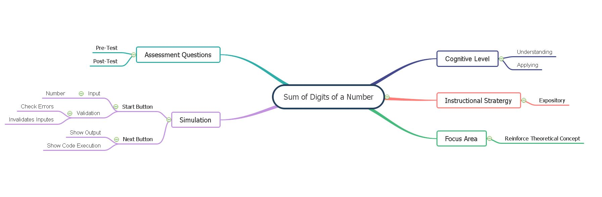

## Storyboard (Round 2)

Experiment 1: Write a program to calculate the sum of digits of a number
### 1. Story Outline:
To find the sum of digits "While loop" is used. The addition of digits of a number is calculated with the help of the remainder and division operator using a while loop. 

### 2. Story:

After the simulation starts, the student will see the code. Students will start execution while executing it shows a message to the user about every statement. when scanf statement executes, the user will input a number. It is stored in variable "num". To Find the sum of digits of the number while loop is executed, in loop to get last digit, modulo division to the number by 10 i.e. lastDigit = num % 10 will be executed and the same will be added to the sum i.e. sum = sum + lastDigit statement will be executed. To get a remaining number it will be divided by 10 i.e. num = num / 10. These steps will be repeated until the number becomes 0. Finally, the program will be left with the sum of digits in variable "sum".

#### 2.1 Set the Visual Stage Description:

The screen is divided into two blocks, one for code execution and other for output Functioning. At the top of the page, there are two buttons named "START" / "NEXT" and "RESET". An input box will appear on the line, where the input statement is written in the code block. The changes are displayed in the execution section.

#### 2.2 Set User Objectives & Goals:
1. To understand application of while loop in program.How while loop executes when condition will be true and false.
2. To apply concept of while loop by adding Digits of a number in the program.

#### 2.3 Set the Pathway Activities:
- The simulator will show step by step execution of the program for every line of code by displaying comments explaining the use of each line. The changing values of variables are shown with every executed statement in code to get a clear understanding of the c program written using a while loop.
- As the while loop gets executed simulator shows the execution of a while loop when the condition is true and how it will execute when it will be false. So it will make the student understand the application of a while loop in the program. The changes in values of variables also shown by highlighting the border of boxes in the simulator.

##### 2.4 Set Challenges and Questions/Complexity/Variations in Questions:

NA

##### 2.5 Allow pitfalls:
This pitfall does not mean the wrong answer and retrying. It is designed to clear misconceptions or incorrect knowledge. Pitfalls are used to check the attention of program by the student. If the student kept input blank or entered input greater than 10 digits, it will display the message invalid input and try again.

##### 2.6 Conclusion:
The simulation will make the student understand and predict the behavior of while loops. Students will be able to write valid while loops. They will be able to describe and understand the condition part of while loops. They will get to know the flow of execution for the while loop.

##### 2.7 Equations/formulas: NA

### 3. Flowchart 
  
### 4. Mindmap:
   

### 5. Storyboard :
Storyboard : <a href="storyboard/storyboard_sum_of_digits.gif"> HERE </a>
