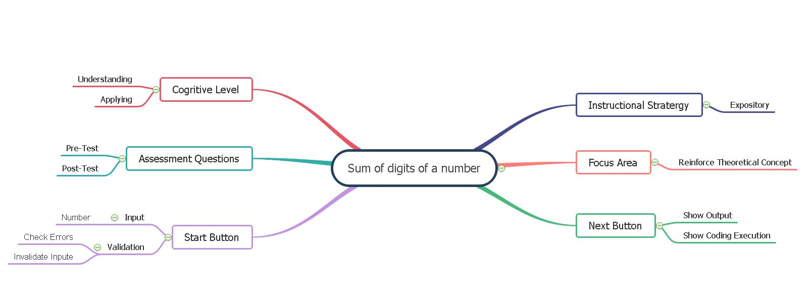

## Storyboard (Round 2)

Experiment 1: Write a program to sum digits of a number
### 1. Story Outline:
To find the sum of digits "While loop" is used.The addition of digits of number is calculated with the help of remainder and division operator using while loop. 

### 2. Story:

After simulation starts,student will see code.Student will start execution, while executing it shows message to user about every statement. when scanf statement executes,user will input a number.It is stored in variable "num". To Find sum of digits of the number while loop is executed, in loop to get last digit,modulo division to the number by 10 i.e. lastDigit = num % 10 will be executed and same will be added to the sum i.e. sum = sum + lastDigit will be executed. To get remaining number it will be divided by 10 i.e. num = num / 10. These steps will be repeated till number becomes 0. Finally program will be left with the sum of digits in variable "sum".

#### 2.1 Set the Visual Stage Description:

When the student visits the link of the simulator page, he sees canvas of screen size (light orange shade) with title in top center "SUM OF DIGIT". On this canvas START button is seen to start program.Once START button is clicked button will turned to "NEXT" button.  The screen is divided into two blocks one for code execution and Output Functioning . when user click on "NEXT" execution will start and when scanf  statement is reached input box will be shown infront of the input statment.After giving input and clicking SUBMIT,It will change to NEXT button again. In Output Functioning box ,values of variables "sum","Remainder" and "Number" will be displayed. Code will appear on code execution block on left side.

#### 2.2 Set User Objectives & Goals:
1. To understand application of while loop in program.How while loop executes when condition will be true and false.
2. To apply concept of while loop by adding Digits of a number in the program.

#### 2.3 Set the Pathway Activities:
-The simulator will show step by step execution of program for every line of code by displaying comments explaining use of each line. The changing values of variables are shown with every excuted statement in code to get clear understanding of the c program written using while loop.
-As the while loop get excuted simulator shows the excution of while loop when condition is true and how it will excute when it will be false. So it will make student understand application of while loop in the program.The changes in values of variables also shown by highlighting the border of boxes in the simulator.

##### 2.4 Set Challenges and Questions/Complexity/Variations in Questions:

NA

##### 2.5 Allow pitfalls:
This pitfall does not mean wrong answer and retrying. It is designed to clear misconceptions or incorrect knowledge.Pitfalls are used to check the attention of program by the student.If the student kept input blank or entered input greater than 10 digits, it will display message invalid input and try again.

##### 2.6 Conclusion:
The simulation will make student  to understand and predict the behavior of while loops.Student will be able to write valid while loops.They will be able to describe and understand the condition part of while loops.They will get to know flow of excution for while loop.

##### 2.7 Equations/formulas: NA

### 3. Flowchart 
  
### 4. Mindmap:
   

### 5. Storyboard :
Storyboard : <a href="storyboard/storyboard_sum_of_digits.gif"> HERE </a>
