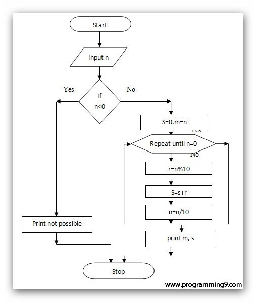

## Storyboard (Round 2)

Experiment 1: Write a program to sum digit of a number
### 1. Story Outline:

To find the sum of digits we cut the last digit by taking the remainder after dividing the number by 10, and then divide the number by 10 again and again until the number becomes 0.To do these task in a single statement for loop can be used. As we know there are three different sections in the for loop. In the initialization phase we are doing nothing in this case, then in the condition checking phase are checking whether the number is greater than 0 or not. In the increment decrement phase, we are doing multiple tasks. At first we are incrementing the sum by taking the last digits of the number, and also reduce the number by dividing it by 10. By performing this experiment the student is able to understand the concept of loops and application of modulo operator.

2. Story:

### 2. Story:

C is an imperative procedural language. It was designed to be compiled to provide low-level access to memory and language constructs that map efficiently to machine instructions, all with minimal runtime support. Despite its low-level capabilities, the language was designed to encourage cross-platform programming. A standards-compliant C program written with portability in mind can be compiled for a wide variety of computer platforms and operating systems with few changes to its source code. The Experiment is
based on loops. Loops are used when a block of code needs to be executed several number of times. In general, statements are executed sequentially: The first statement in a function is executed first, followed by the second, and so on.Loop control statements change execution from its normal sequence. When execution leaves a scope, all automatic objects that were created in that scope are destroyed.Programming languages provide various control structures that allow for more complicated execution paths.

#### 2.1 Set the Visual Stage Description:
When the student visits the link of the simulator page, he sees canvas of screen size (light orange shade). On this canvas input box to take input from user and blocks for code execution and Output Functioning are seen. On top-centre of the screen he observes the title ‘Sum of Digits’. Just below the title user observes an input box under the title Input section. Below input box there are three buttons "Submit", "Reset" and "Next".After entering number in input box ,user wil click on submit button ,code will appear on code execution block on left side and three boxes to display values of variable "sum","Remainder" and Number will be displayed on Output Functioning block.After pressing Next button program will excute step by step and changes in the values will be shown into respective boxes.

#### 2.2 Set User Objectives & Goals:
1. The prime objective of the experiment is to find sum of digits of a number entered by user
2. To identify Logic required for finding the output
3. To Describe Logic in terms of c Programming construct
4. To be able to apply formulas required to get output

#### 2.3 Set the Pathway Activities:
1. Click on the button “Start the simulator”. It takes to simulation screen.
2. Enter number into input box and click on "Submit" button.
3. Program Code will appear in Code block and Variable names "Number","Remainder","Sum" with initialzed value to zero in right block will appear.
4. Click on "next" button for executing step by step instruction ,It will show values changing in the variables in right block.
5. After excection it will show "Execution Completed".

##### 2.4 Set Challenges and Questions/Complexity/Variations in Questions:

Formative assesment questions as mentioned in Round 1
Difficulty level: REMEMBER  
Q How many types of loop are avilable in C Program? 
A.1 
B.2 
C.<b>3</b> 
D.4 
Formative assesment questions as mentioned in Round 1 
Difficulty level: RECALL 
Q 
#include <stdio.h> 
 
 <pre>
 int main()
{
    int i = 1024;
    for (; i; i >>= 1)
        printf("GeeksQuiz");
    return 0;
}
</pre>

How many times will GeeksQuiz be printed in the above program? 
A 10 
B 11
C Infinite 
D The program will show compile-time error

Formative assesment questions as mentioned in Round 1
Difficulty level: DEFINE

include <stdio.h>
int i;
int main()
{
    if (i);
    else
        printf("Ëlse");
    return 0;
}
What is correct about the above program?
A if block is executed.
# B else block is executed.
C It is unpredictable as i is not initialized.
D Error: misplaced else

Formative assesment questions as mentioned in Round 1
Difficulty level: APPLY

#include<stdio.h>
main() {
   int n=4576, sum = 0;
  for(; n > 0; sum += n%10, n/= 10) {
   }
   printf("The sum of digits: %d", sum);
}
What is the value of sum?
A. 4576
### B. 22
C. 23
D. 34

##### 2.5 Allow pitfalls:
This pitfall does not mean wrong answer and retrying. It is designed to clear misconceptions or incorrect knowledge.Pitfalls are used to check the attention of program by the student.
Choose a correct C do while syntax.
A) 
dowhile(condition)
{
    //statements
}
B) 
do while(condition)
{
    //statements
}
C) 
do
{
    //statements

}while(condition)
D) 
do
{
    //statements

}while(condition);

##### 2.6 Conclusion:
Time taken by the student to attempt the questions: ----
The student correctly answered: -----/4
At the completion of this experiment, following are the interpretations/ conclusions,
A.  B.  C.
There are 4 programming questions with different difficulty levels. Assessment/evaluation of the multiple choice questions will be given immediately to the student. When the student clicks on the answer of his choice, the correct answer will be displayed below the question. This would enable the student to understand whether he is right or wrong. The approximate time required to understand the procedure to perform the experiment would take about 5 min. To generate data will take another 10 minutes. Calculating and entering the values in the observation table will take approximately 10 minutes. Answering the assessment questions will take about 5 min. Thus the total time required to perform the experiment will require around 10 minutes.

##### 2.7 Equations/formulas: NA

### 3. Flowchart 4
 
link to flow chart Here : Store in the  /flowchart folder within Round2 folder in your repo
 
(guide :The lab proposer should extract logic from the story, prepare a flowchart from the story narration and write the algorithm to execute the black box.  use Google Drawings https://docs.google.com/drawings/ (send the link to your flowchart and also attach .png by exporting it )

### 4. Mindmap:

 Link to mindmap here : Store the mindmap in both .mm & .png extension in the  /mindmap folder and include link of only .pdf verison here
  
 (guide : An elaborate mind map (connecting all the points in the experiment flow ) should be prepared and submitted by the lab proposer. The mind map should be a clear and detailed document that takes into account all minute intri5acies involved in the development of virtual lab. The mindmap should be self-content and any developer across the globe should be able to code it with all those details. using only FreeMind http://freemind.sourceforge.net/wiki/index.php/Main_Page (send the .png file and also the original .mm extension project file. )

### 5. Storyboard :
Storyboard: <a href="Storyboard/carwiper.gif"> [here]</a>
Link to storybaord (.gif file ) here :
(guide: This document should include sketching and description scene wise (duration, action, description). Software to be used for storyboarding : https://wonderunit.com/storyboarder/ (Its a FOSS tool) . tutorial on how to use it https://www.youtube.com/watch?v=LAeCEpG0KX4
