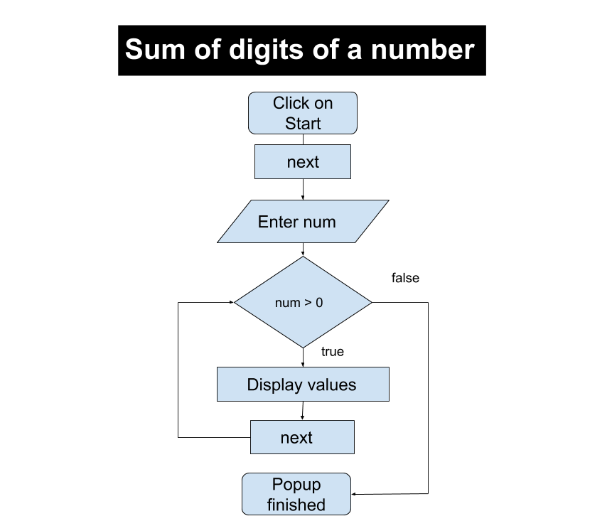

## Storyboard (Round 2)

Experiment 1: Write a program to sum digits of a number
### 1. Story Outline:
The Experiment is based on loops. Loops are used when a block of code needs to be executed several number of times. In general, statements are executed sequentially: The first statement in a function is executed first, followed by the second, and so on.Loop control statements change execution from its normal sequence. When execution leaves a scope, all automatic objects that were created in that scope are destroyed.Programming languages provide various control structures that allow for more complicated execution paths.
It shows step by step instruction execution of program to understand the what each statement in program is performing.To find the sum of digits student will get the number,Declare a variable to store the sum and set it to 0 .Repeat the next two steps till the number is not 0 using while loop.Get the rightmost digit of the number with help of remainder ‘%’ operator by dividing it with 10 and add it to sum.Divide the number by 10 with help of ‘/’ operator.Print or return the sum. 

### 2. Story:

After simulation starts,student will see code.Student will start execution while executing it shows message to user about every statemt. when scanf statement executes user will input a number.It is Stored  in variable number.To Find sum of digits of the number while loop is executed. in loop to get last digit modulo division the number by 10 i.e. lastDigit = num % 10 will be executed and Addition of  last digit found to sum i.e. sum = sum + lastDigit will be executed.It is again repeated in loop remove last digit from number by dividing the number by 10 i.e. num = num / 10.Repeat step 2-4 till number becomes 0. Finally program will be left with the sum of digits in sum.

#### 2.1 Set the Visual Stage Description:

When the student visits the link of the simulator page, he sees canvas of screen size (light orange shade) with title in top center "SUM OF DIGIT". On this canvas START button is seen to start program.Once START button is clicked button will turned to "NEXT" button.  The screen is divided into two blocks one for code execution and Output Functioning . when user click on "NEXT" execution will start and when scanf  statement is reached input box will be shown infront of the input statment.After giving input and clicking SUBMIT,It will change to NEXT button again. In Output Functioning box ,values of variables "sum","Remainder" and Number will be displayed. Code will appear on code execution block on left side.

#### 2.2 Set User Objectives & Goals:
1. To understand application of while loop in program.How while loop executes when condition will be true and false.
2. To apply concept of while loop by adding Digits of a number in the program.

#### 2.3 Set the Pathway Activities:
1. Click on the button “START”. It takes to simulation screen.
2. "START" button will changed to "Next" button,Program Code will appear in Code block and Variable names "Number","Remainder","Sum" with initialzed value to zero in right block will appear.
4. Click on "next" button for executing step by step instruction , user will get comments with every instruction executed.
5. Input box will appear in front of scanf instruction for input to be given, and "Next" button will convert to "SUBMIT" button.
6. After submitting input, SUBMIT turns to Next and program will execute step by step showing changes of the values in Variable names "Number","Remainder","Sum"
5. After excection it will show "Execution Completed" and result in Sum variable.

##### 2.4 Set Challenges and Questions/Complexity/Variations in Questions:

NA

##### 2.5 Allow pitfalls:
This pitfall does not mean wrong answer and retrying. It is designed to clear misconceptions or incorrect knowledge.Pitfalls are used to check the attention of program by the student.If the student kept input blank or entered input greater than interger range, it will display message invalid input and try again.

##### 2.6 Conclusion:
The simulation will make student  to understand and predict the behavior of while loops.Student will be able to write valid while loops.They will be able to describe and understand the condition part of while loops.They will get to know the standard flowchart representation for while loops.They will understand standard pseudocode representation for while loops and they will get to Know how to indent while loops to make them readable.

##### 2.7 Equations/formulas: NA

### 3. Flowchart 4
  
### 4. Mindmap:
   

### 5. Storyboard :
Storyboard : <a href="storyboard/storyboard_sum_of_digits.gif"> HERE </a>
