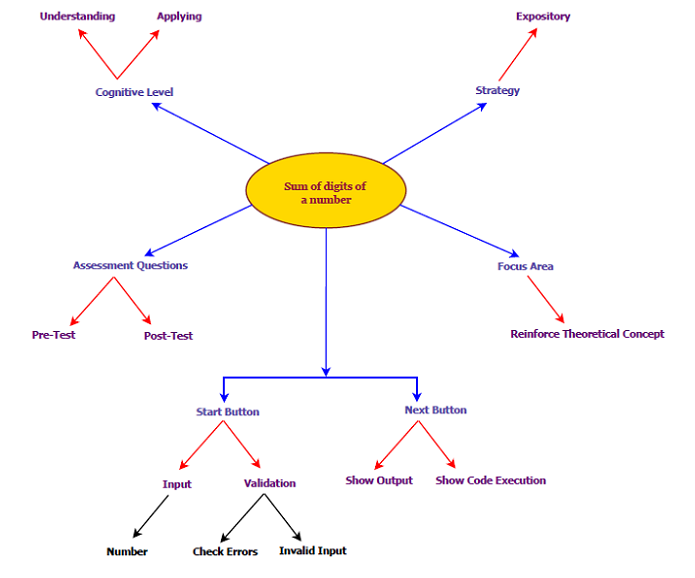

## Storyboard (Round 2)

Experiment 1: Write a program to sum digits of a number
### 1. Story Outline:

To find the sum of digits student will Get the number,Declare a variable to store the sum and set it to 0 .Repeat the next two steps till the number is not 0 using while loop.Get the rightmost digit of the number with help of remainder ‘%’ operator by dividing it with 10 and add it to sum.Divide the number by 10 with help of ‘/’ operator.Print or return the sum.

### 2. Story:
The Experiment is based on loops. Loops are used when a block of code needs to be executed several number of times. In general, statements are executed sequentially: The first statement in a function is executed first, followed by the second, and so on.Loop control statements change execution from its normal sequence. When execution leaves a scope, all automatic objects that were created in that scope are destroyed.Programming languages provide various control structures that allow for more complicated execution paths.

#### 2.1 Set the Visual Stage Description:

When the student visits the link of the simulator page, he sees canvas of screen size (light orange shade) with title in top center "SUM OF DIGIT". On this canvas START button is seen to start program.Once START button is clicked button will turned to "NEXT" button.  The screen is divided into two blocks one for code execution and Output Functioning . when user click on "NEXT" execution will start and when input statement is reached input box will be shown  On top-centre of the screen with "SUBMIT" button.After giving input and clicking SUBMIT,It will change to NEXT button again. In Output Functioning box ,values of variables "sum","Remainder" and Number will be displayed. Code will appear on code execution block on left side.

#### 2.2 Set User Objectives & Goals:
1. The prime objective of the experiment is to find sum of digits of a number entered by user
2. To understand use of while loop 
3. To apply concept of while loop

#### 2.3 Set the Pathway Activities:
1. Click on the button “START”. It takes to simulation screen.
2. "START" button will changed to "Next" button,Program Code will appear in Code block and Variable names "Number","Remainder","Sum" with initialzed value to zero in right block will appear.
4. Click on "next" button for executing step by step instruction , user will get comments with every instruction executed.
5. Input box will appear when instruction for input is executed , and "Next" button will convert to "SUBMIT" button.
6. After submitting input, SUBMIT turns to Next and program will execute step by step showing changes of the values in Variable names "Number","Remainder","Sum"
5. After excection it will show "Execution Completed" and result in Sum variable.

##### 2.4 Set Challenges and Questions/Complexity/Variations in Questions:

Formative assesment questions as mentioned in Round 1
Difficulty level: UNDERSTAND  
Q How many types of loop are avilable in C Program? 
A.1 
B.2 
**C.3** 
D.4  

 <pre>
 #include <stdio.h>
 int main()
{
    int i = 1024;
    for (; i; i >>= 1)
        printf("GeeksQuiz");
    return 0;
}
</pre>
Q How many times will GeeksQuiz be printed in the above program? 
A 10 
**B.11** 
C Infinite 
D The program will show compile-time error  

Formative assesment questions as mentioned in Round 1 
Difficulty level: APPLY  
<pre>
#include <stdio.h>
int i;
int main()
{
    if (i);
    else
        printf("Ëlse");
    return 0;
}
</pre>

Q What is correct about the above program? 
A if block is executed. 
**B else block is executed.** 
C It is unpredictable as i is not initialized. 
D Error: misplaced else  

<pre>
#include<stdio.h>
main() {
   int n=4576, sum = 0;
  for(; n > 0; sum += n%10, n/= 10) {
   }
   printf("The sum of digits: %d", sum);
}
</pre>

What is the value of sum? 
A. 4576 
**B. 22** 
C. 23 
D. 34  

##### 2.5 Allow pitfalls:
This pitfall does not mean wrong answer and retrying. It is designed to clear misconceptions or incorrect knowledge.Pitfalls are used to check the attention of program by the student. 
<pre>
#include<stdio.h>
int main(){
	float ft = 7.5;
	while(ft)
	{
		printf("Loop");
		ft = ft - .5;
		if(ft == 5.0f)
			break;
	}
	return 0;
}
</pre>
A. Prints Nothing

B. Looop

C. Loop Loop Loop Loop Loop

D. Compilation Error

##### 2.6 Conclusion:
Time taken by the student to attempt the questions: ----
The student correctly answered: -----/4
At the completion of this experiment, following are the interpretations/ conclusions,
A.  B.  C.
There are 4 programming questions with different difficulty levels. Assessment/evaluation of the multiple choice questions will be given immediately to the student. When the student clicks on the answer of his choice, the correct answer will be displayed below the question. This would enable the student to understand whether he is right or wrong. The approximate time required to understand the procedure to perform the experiment would take about 5 min. To generate data will take another 10 minutes. Calculating and entering the values in the observation table will take approximately 10 minutes. Answering the assessment questions will take about 5 min. Thus the total time required to perform the experiment will require around 10 minutes.

##### 2.7 Equations/formulas: NA

### 3. Flowchart 4
  
### 4. Mindmap:

 Link to mindmap here : <a href="storyboard/mindmap_sum.pdf"> HERE </a>    

### 5. Storyboard :

Storyboard : <a href="storyboard/storyboard_sum_of_digits.gif"> HERE </a>
